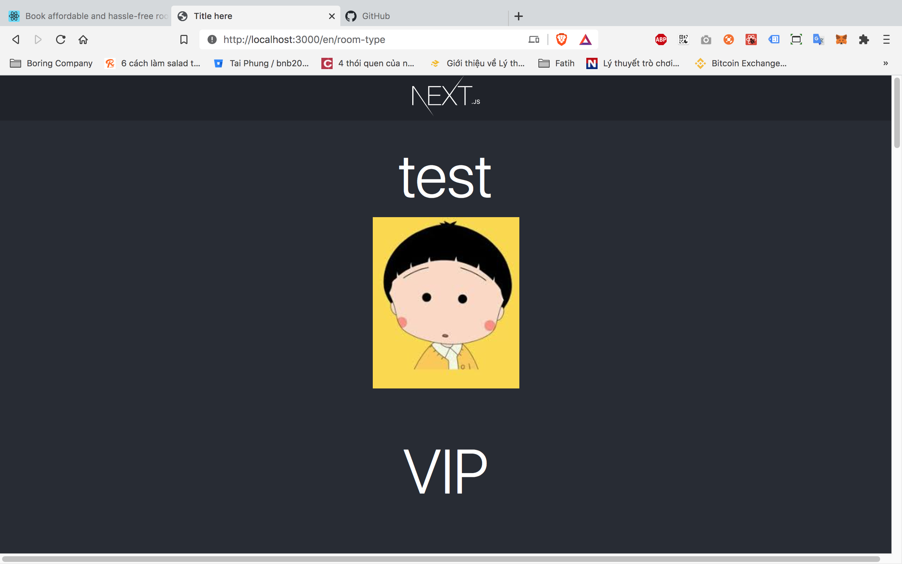

## Install
```bash
yarn install
```

## Available Scripts

### Running the development server.

```bash
    yarn dev
```

### Building for production.

```bash
    yarn build
```

### Running the production server.

```bash
    yarn start
```

### Linting & formatting your code.

```bash
    yarn lint
```

### Running your tests.

```bash
    yarn test
```

## Structure
ví dụ tạo 1 page với path là : room-type

### http://localhost:3000/en/room-type


### /pages/room-type
```text
+ index.tsx : neNextPage 
++ async function getStaticProps(): Promise<{ props: IProps }>  : server side code
++ RoomTypePage: NextPage = ({ data }): IProps : client side code 
+ components: các components con của page
++ index.ts : room-type component 
```

### src/redux/slices/room-type
reduxjs/toolkit

### src/interfaces
interfaces 

### services/room-type.service.ts
API services

## Learn More

To learn more about **superplate**, please check out the [Documentation](https://github.com/pankod/superplate).

### **React-Bootstrap**

Quickly design and customize responsive mobile-first sites with Bootstrap, the world’s most popular front-end open source toolkit.

[Go To Documentation](https://getbootstrap.com/docs/5.0/getting-started/introduction/)

### **Styled Components**

Utilising tagged template literals (a recent addition to JavaScript) and the power of CSS, styled-components allows you to write actual CSS code to style your components.

[Go To Documentation](https://styled-components.com/docs)

### **Styled System**

Styled System is a collection of utility functions that add style props to your React components and allows you to control styles based on a global theme object with typographic scales, colors, and layout properties.

[Go To Documentation](https://styled-system.com/getting-started)

### **Axios**

Promise based HTTP client for the browser and node.js.

[Go To Documentation](https://github.com/axios/axios)

### **Environment Variables**

Use environment variables in your next.js project for server side, client or both.

[Go To Documentation](https://github.com/vercel/next.js/tree/canary/examples/environment-variables)

### **Reverse Proxy**

Proxying some URLs can be useful when you have a separate API backend development server and you want to send API requests on the same domain.

[Go To Documentation](https://webpack.js.org/configuration/dev-server/#devserverproxy)

### **Bundle Analyzer**

Use webpack-bundle-analyzer in your Next.js project. Visualize size of webpack output files with an interactive zoomable treemap.

[Go To Documentation](https://github.com/vercel/next.js/tree/canary/packages/next-bundle-analyzer)

### **SWR**

React Hooks library for data fetching from Vercel

[Go To Documentation](https://swr.vercel.app/)

### **React Query**

Hooks for fetching, caching and updating asynchronous data in React.

[Go To Documentation](https://react-query.tanstack.com/overview)

### **react-use**

A Collection of useful React hooks.

[Go To Documentation](https://github.com/streamich/react-use)

### **React Redux**

Redux helps you write applications that behave consistently, run in different environments (client, server, and native), and are easy to test.

[Go To Documentation](https://redux.js.org/introduction/getting-started)

### **next-i18next**

next-i18next is a plugin for Next.js projects that allows you to get translations up and running quickly and easily, while fully supporting SSR, multiple namespaces with codesplitting, etc.

[Go To Documentation](https://github.com/isaachinman/next-i18next)

### **ESLint**

A pluggable and configurable linter tool for identifying and reporting on patterns in JavaScript. Maintain your code quality with ease.

[Go To Documentation](https://eslint.org/docs/user-guide/getting-started)

### **Prettier**

An opinionated code formatter; Supports many languages; Integrates with most editors.

[Go To Documentation](https://prettier.io/docs/en/index.html)

### **lint-staged**

The concept of lint-staged is to run configured linter (or other) tasks on files that are staged in git.

[Go To Documentation](https://github.com/okonet/lint-staged)

### **Enzyme**

Enzyme is a JavaScript Testing utility for React that makes it easier to test your React Components&#39; output. You can also manipulate, traverse, and in some ways simulate runtime given the output.

[Go To Documentation](https://enzymejs.github.io/enzyme/)

### **Cypress**

Fast, easy and reliable testing for anything that runs in a browser.

[Go To Documentation](https://docs.cypress.io/guides/overview/why-cypress.html)

### **Docker**

Docker simplifies and accelerates your workflow, while giving developers the freedom to innovate with their choice of tools, application stacks, and deployment environments for each project.

[Go To Documentation](https://www.docker.com/get-started)

## License

MIT
